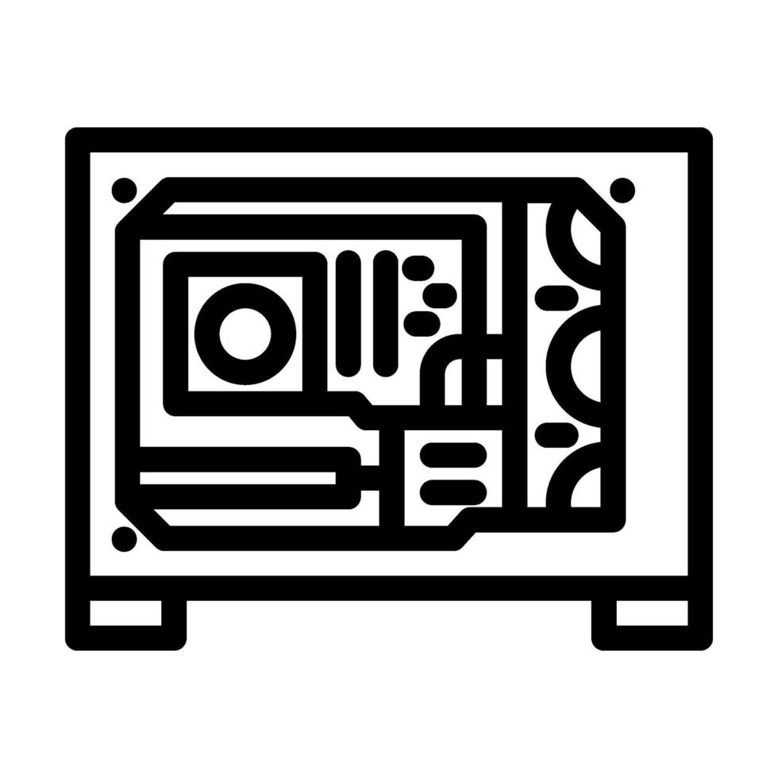
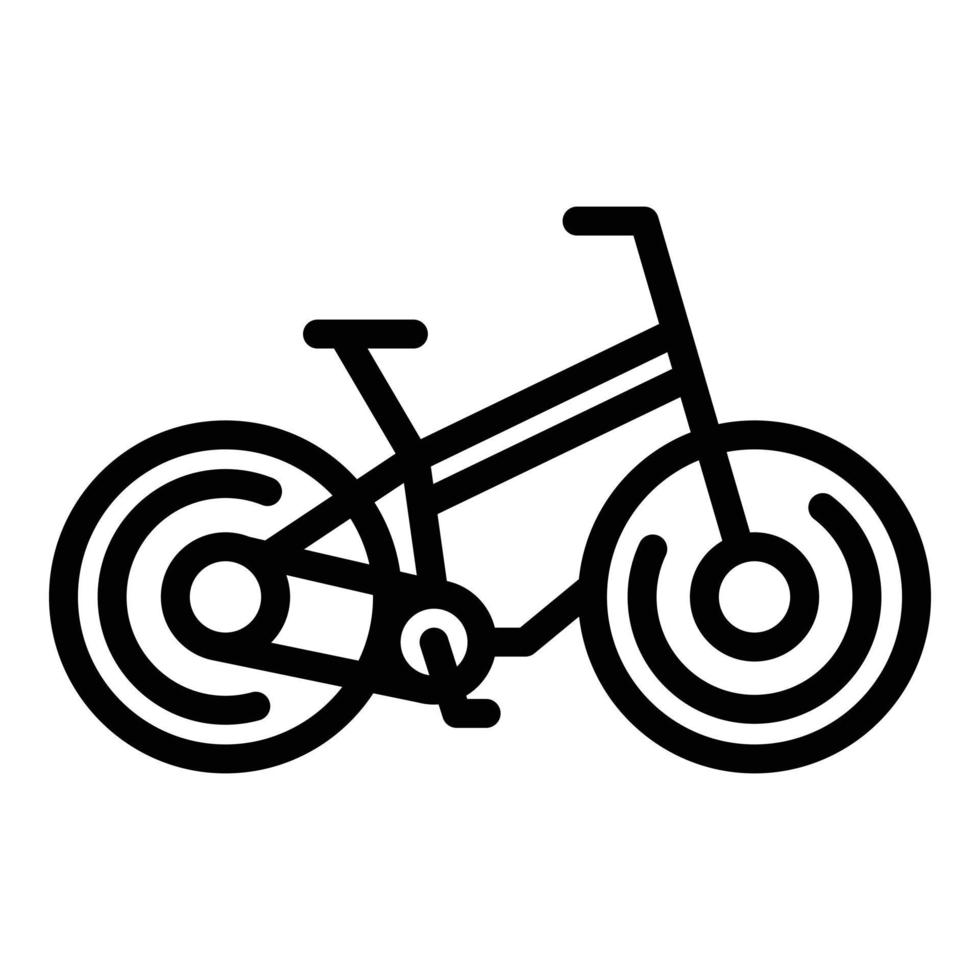

At 58Mods we can bring your dream to reality by building you a custom computer. Whether this is a personal gaming computer, a computer you would want for streaming, a computer for your organization to do complex tasks like visual effects, video editing or some kind of game development, 58Mods had got you covered.

All you need to do is fill the form here: [Contact](https://58mods.github.io/home/contact) with your budget and purpose for the computer then 58Mods will reach out to you with a recommended quote and estimated timeline of completion.

<h2>Solutions</h2>

  

  <h2>Custom PC builds</h2>
  We build custom PCs based on customer budget and purpose. Just [Reach out](https://58mods.github.io/home/contact) to us to get a system!

    

  <h2>CCTV Installation</h2>
  At 58mods we do both home and office installations. [Reach out](https://58mods.github.io/home/contact) to us with all details to get a quote.

    

  <h2>Bicycle Maintenance and Repairs</h2>
  Coming soon to 58mods is repair and maintenance of bicycles. [Reach out](https://58mods.github.io/home/contact) to us with all details to get a quote.
